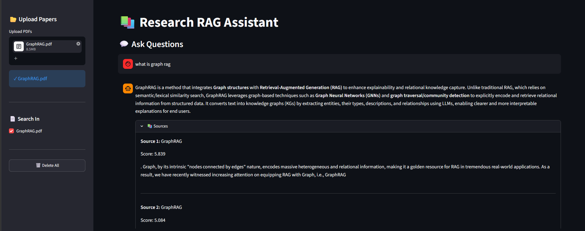
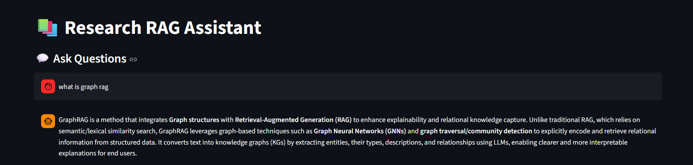
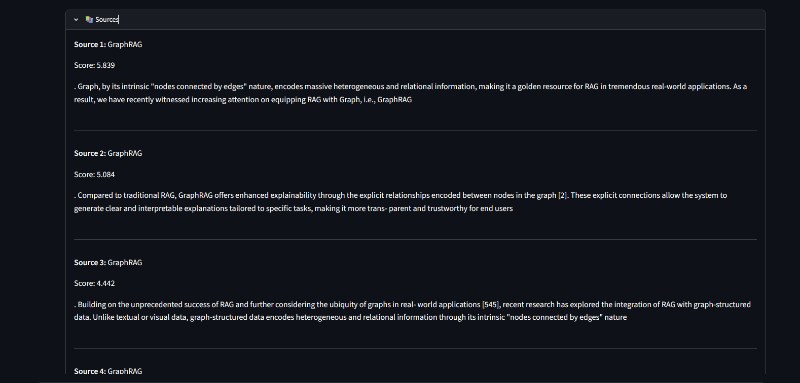

# 🚀 [Tips Hindawi](https://www.tipshindawi.com/) Challenge (June–July) 2026

> 🏆 This repository is my official submission for the [ **Tips Hindawi** ](https://www.tipshindawi.com/) **Challenge (June–July) 2026**.

## 👤 Participant

| Field            | Value                                |
| ---------------- | ------------------------------------ |
| Full Name        |          Mariam Ahmed Ali            |
| Project Name     |   AI Assistant for Research papers   |
| GitHub Username  |            mariiamahmed              |
| Challenge Batch  | June–July 2026                       |
| Training Program | Large Language Models (LLMs) Program |
| Organization     | [**Edrak for Ai**](https://edrak4ai.com/en)                         |

---

# 📖 Project Overview

RAG Research Assistant is a web application that allows users to upload one or multiple PDF research papers. in PDF format and ask questions about their content. The system retrieves the most relevant information from the uploaded documents and uses a Large Language Model (LLM) to generate accurate, context-based answers.

---

# ✨ Features

- Upload one or multiple PDF research papers.
- Select which uploaded papers to search using checkboxes.
- Semantic search using **BAAI/bge-small-en-v1.5** embeddings.
- Vector storage with Qdrant Cloud.
- Improved retrieval using the CrossEncoder (cross-encoder/ms-marco-MiniLM-L-12-v2) reranker.
- Context-aware answer generation using the Mistral LLM.
- Prevents answering unrelated questions using reranker threshold filtering.
- Displays retrieved source passages for transparent answers.
- Simple and interactive Streamlit interface.

---

# 🛠️ Technologies Used

- Python
- Streamlit
- PyMuPDF
- LangChain Text Splitters
- Sentence Transformers
- Qdrant Cloud
- Mistral LLM
---

# ⚙️ Installation

1. Clone the repository.
2. Create and activate a virtual environment.
3. Install the required packages:
   ```bash
   pip install -r requirements.txt
   ```
4. Add your API keys to the `.env` file.
5. Run the application:
   ```bash
   streamlit run app.py
   ```

---

# 🔑 Environment Variables

Create a `.env` file in the project root by copying `.env.example`:

```bash
cp .env.example .env
```

Then update the values in `.env` with your own configuration:

```env
QDRANT_URL=http://localhost:6333
MISTRAL_API_KEY=your_mistral_api_key
```

> **Note:** If you're using Qdrant Cloud instead of a local Qdrant instance, replace `QDRANT_URL` with your Qdrant Cloud endpoint and set your `QDRANT_API_KEY`.

---

# 🚀 Usage

1. Launch the application.
2. Upload one or more research papers in PDF format.
3. Wait for the papers to be processed and indexed.
4. Select the paper(s) you want to search.
5. Enter a question about the selected paper(s).
6. View the generated answer and supporting source passages.

---
## 🏗️ System Architecture

```text
PDF Upload
     │
     ▼
Text Extraction (PyMuPDF)
     │
     ▼
Text Chunking
     │
     ▼
BGE Embeddings
     │
     ▼
Qdrant Cloud
     │
     ▼
Semantic Retrieval
     │
     ▼
CrossEncoder Reranker
     │
     ▼
Threshold Filtering
     │
     ▼
Mistral LLM
     │
     ▼
Generated Answer + Sources
```

---

# 🔄 Example Workflow

1. Upload one or more PDF research papers.
2. The application extracts and cleans the text.
3. The text is split into overlapping chunks.
4. Each chunk is converted into a BGE embedding.
5. Embeddings are stored in Qdrant Cloud.
6. When a question is asked:
   - The question is embedded.
   - Qdrant retrieves the most relevant chunks.
   - A CrossEncoder reranks the retrieved chunks.
   - A relevance threshold filters unrelated results.
   - The Mistral LLM generates an answer using only the retrieved context.
7. The answer and supporting source passages are displayed.

---
# 📸 Demo

## Application Overview

<p align="center">
  
</p>

---

## Upload Papers & Select Search Scope

<p align="center">
  
  
</p>

---

## Generated Answer with Sources

<p align="center">
  
</p>

---

## Handling Irrelevant Questions

<p align="center">
  
</p>

---

# 📈 Results

- Answers are generated only from the selected research paper(s).
- Semantic retrieval combined with reranking improves answer quality.
- Irrelevant questions are rejected when no relevant context is found.
- Retrieved source passages are displayed for transparency.

---

# 🔮 Future Improvements

* Support additional document formats (DOCX, TXT, etc.).
* Add conversation history and citations.
* Support multimodal documents containing images and tables.

---

# 📚 About the Challenge

This project was developed as part of the [**Tips Hindawi**](https://www.tipshindawi.com/) **Challenge (June–July) 2026**.

[Tips Hindawi](https://www.tipshindawi.com/) is the internships department of [**Edrak for Ai**](https://edrak4ai.com/en), and the challenge encourages participants to build real-world projects, apply practical skills, and showcase their work through GitHub.

For more information about the challenge, training programs, and upcoming batches, visit the official [Tips Hindawi](https://www.tipshindawi.com/) website.

---

# 📄 License

This project is shared for educational and portfolio purposes.
