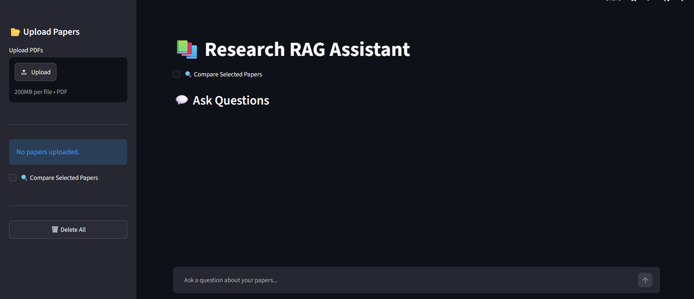
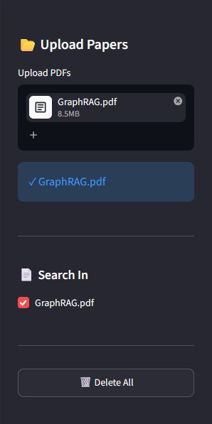
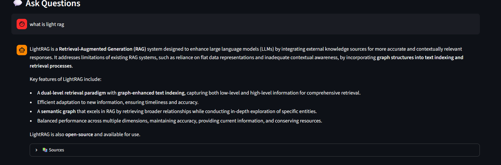
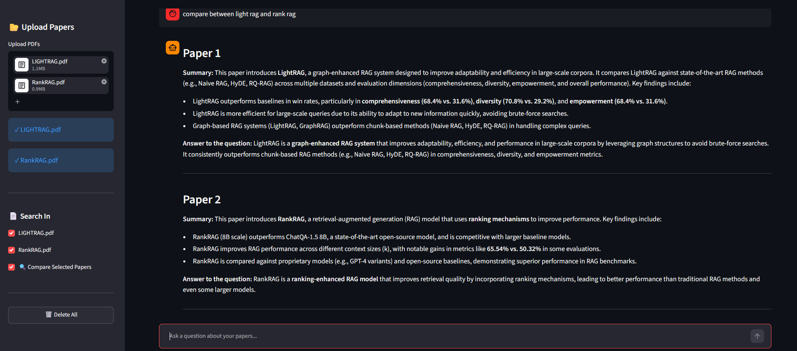
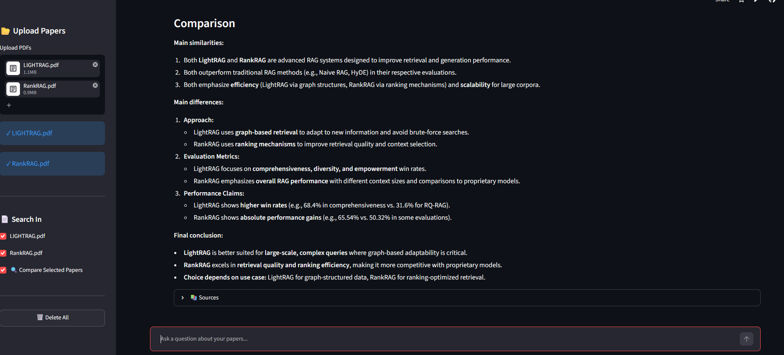
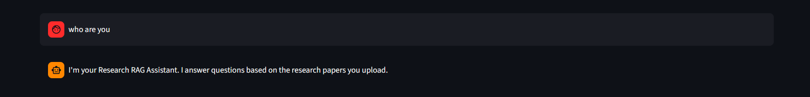

# 🚀 [Tips Hindawi](https://www.tipshindawi.com/) Challenge (June–July) 2026

> 🏆 This repository is my official submission for the [ **Tips Hindawi** ](https://www.tipshindawi.com/) **Challenge (June–July) 2026**.

## 👤 Participant

| Field            | Value                                |
| ---------------- | ------------------------------------ |
| Full Name        |          Mariam Ahmed Ali            |
| Project Name     |   AI Assistant for Research papers   |
| GitHub Username  |            mariiamahmed              |
| Challenge Batch  | June–July 2026                       |
| Training Program | Large Language Models (LLMs) Program |
| Organization     | [**Edrak for Ai**](https://edrak4ai.com/en)                         |

---

# 📖 Project Overview

Research RAG Assistant is a Retrieval-Augmented Generation (RAG) application that enables users to upload one or multiple research papers in PDF format, ask natural-language questions, compare selected papers, and receive grounded answers generated only from the uploaded documents. The system combines semantic retrieval, reranking, and a Large Language Model (Mistral) to provide accurate, transparent responses with supporting source passages.

---
## ✨ Features

- Upload one or multiple research papers in PDF format.
- Search across all uploaded papers or only selected papers.
- Compare two selected research papers side by side.
- Semantic search using **BAAI/bge-small-en-v1.5** embeddings.
- Fast vector search with **Qdrant Cloud**.
- Improved retrieval using the **CrossEncoder (cross-encoder/ms-marco-MiniLM-L-6-v2)** reranker.
- Automatic query normalization and typo correction for more robust retrieval.
- Generates answers using the **Mistral LLM**.
- Rejects unrelated questions using reranker threshold filtering.
- Displays retrieved source passages and relevance scores.
- Interactive web interface built with **Streamlit**.
- Ready for deployment on **Streamlit Cloud**.

---

## 🛠️ Technologies Used

- Python
- Streamlit
- PyMuPDF
- LangChain Text Splitters
- Sentence Transformers
- BAAI/bge-small-en-v1.5
- CrossEncoder (ms-marco-MiniLM-L-6-v2)
- Qdrant Cloud
- Mistral AI
- python-dotenv

---
## 🚀 Quick Start

### Try it online

The application is deployed on **Streamlit Cloud**.

👉 **Live Demo:**  

https://research-rag-assistant-wzs8dghxdaigbscr2fexnb.streamlit.app/

## Run locally

### 1. Clone the repository

```bash
git clone https://github.com/mariiamahmd/Research-Rag-Assistant.git
cd Research-Rag-Assistant
```

### 2. Create a virtual environment

Windows

```bash
python -m venv .venv
.venv\Scripts\activate
```

Linux / macOS

```bash
python3 -m venv .venv
source .venv/bin/activate
```

### 3. Install dependencies

```bash
pip install -r requirements.txt
```

---

## 🔑 Environment Variables

Create a `.env` file in the project root.

```env
QDRANT_URL=https://your-cluster-url.cloud.qdrant.io
QDRANT_API_KEY=your_qdrant_api_key
MISTRAL_API_KEY=your_mistral_api_key
```

### Streamlit Cloud Deployment

When deploying to Streamlit Cloud, add the same variables under:

**App → Settings → Secrets**

```toml
QDRANT_URL="https://your-cluster-url.cloud.qdrant.io"
QDRANT_API_KEY="your_qdrant_api_key"
MISTRAL_API_KEY="your_mistral_api_key"
```

---

## ▶️ Running the Application

```bash
streamlit run app.py
```

---

## 🚀 Usage

1. Upload one or more research papers.
2. Wait until they are processed and indexed.
3. Select the paper(s) you want to search.
4. Ask a question.
5. View the generated answer together with the retrieved source passages.

### Paper Comparison

Enable **Compare Selected Papers**, select exactly **two papers**, and ask a comparison question such as:

> Compare the retrieval methods used in these papers.

The assistant summarizes the similarities and differences using information retrieved from both papers.

---

# 🏗️ System Architecture

```text
                    PDF Upload
                         │
                         ▼
           Text Extraction (PyMuPDF)
                         │
                         ▼
      Text Chunking (LangChain Splitter)
                         │
                         ▼
        BGE Embedding Generation
                         │
                         ▼
               Qdrant Cloud Storage
                         │
                         ▼
            Semantic Vector Retrieval
                         │
                         ▼
           CrossEncoder Reranking
                         │
                         ▼
            Threshold Filtering
                         │
                         ▼
             Mistral LLM Generation
                         │
                         ▼
        Final Answer + Source Passages
```

---

## 🔄 Workflow

### Document Processing

1. Upload a PDF.
2. Extract text using **PyMuPDF**.
3. Split the text into overlapping chunks.
4. Generate embeddings for each chunk.
5. Store embeddings and metadata in **Qdrant Cloud**.

### Question Answering

1. Embed the user's question.
2. Retrieve the most similar chunks from Qdrant.
3. Rerank retrieved chunks using the CrossEncoder.
4. Filter irrelevant results using a relevance threshold.
5. Generate an answer using only the retrieved context.
6. Display the answer together with the supporting source passages.

---

# 📸 Demo

## Application Overview

<p align="center">
    
</p>

---

## Question Answering

<p align="center">
    
    
</p>

---

## Generated Answer with Sources

<p align="center">
    
</p>

---

## Paper Comparison


<p align="center">
    
    <Br>
    
</p>

---

## Handling Irrelevant Questions

<p align="center">
    
    
</p>

---

# 📈 Results

- Generates answers grounded only in the uploaded research papers.
- Supports searching across one or multiple selected papers.
- Improves retrieval quality using semantic search followed by reranking.
- Automatic query normalization improves retrieval robustness for misspelled queries.
- Rejects questions when no relevant context is available.
- Displays retrieved source passages and reranker scores for transparency.
- Supports comparing two research papers using retrieved evidence from both.

# 🔮 Future Improvements

- Support DOCX, TXT, and Markdown documents.
- Support image-based PDFs using OCR.
- Export answers and comparisons as PDF.
 
---

## 👩‍💻 Author

Developed as a Research RAG Assistant project using:

- Streamlit
- Qdrant Cloud
- Sentence Transformers
- Mistral AI
- LangChain Text Splitters

---

# 📚 About the Challenge

This project was developed as part of the [**Tips Hindawi**](https://www.tipshindawi.com/) **Challenge (June–July) 2026**.

[Tips Hindawi](https://www.tipshindawi.com/) is the internships department of [**Edrak for Ai**](https://edrak4ai.com/en), and the challenge encourages participants to build real-world projects, apply practical skills, and showcase their work through GitHub.

For more information about the challenge, training programs, and upcoming batches, visit the official [Tips Hindawi](https://www.tipshindawi.com/) website.

---

# 📄 License

This project is shared for educational and portfolio purposes.
